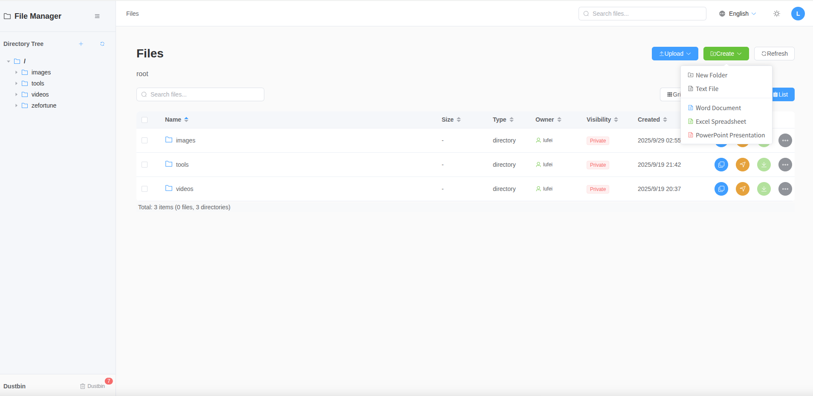
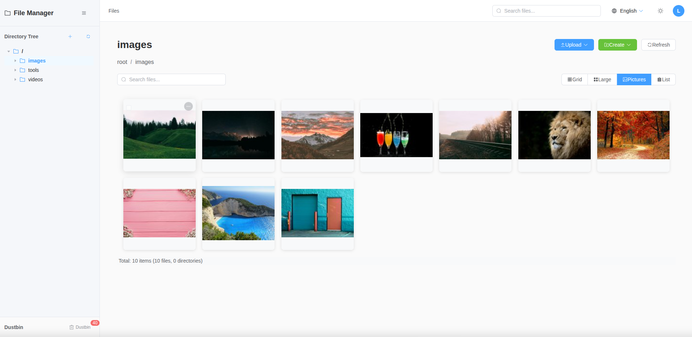
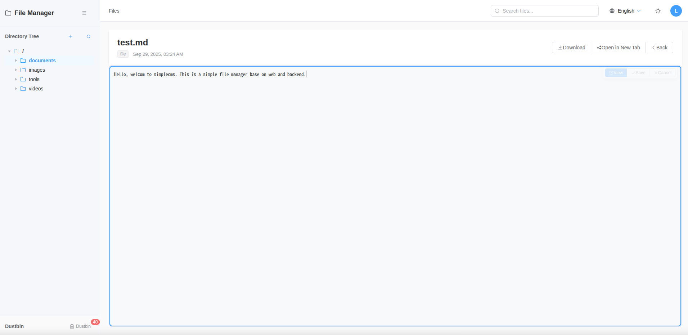
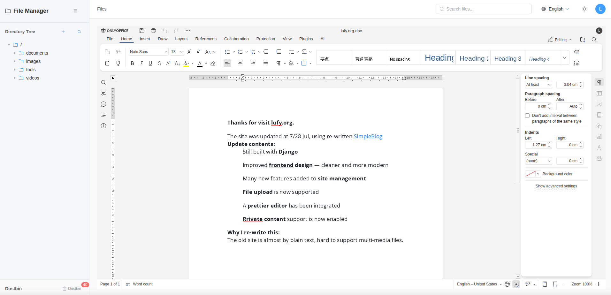

# SimpleCMS - File Management System

A comprehensive Content Management System built with Django and Vue.js that can manage any kind of file on your disk.

## Features

- **File System Management**: Browse, upload, download, and manage files and directories
- **Access Control**: Public/private file visibility and user ownership
- **File Operations**: Copy, move, delete, and rename files
- **Office integratable**: Can integrate onlyoffice document-server
- **Access Logging**: Track file access, downloads, and modifications
- **RESTful API**: Full API for frontend integration
- **Admin Interface**: Django admin for system management

## Preview

Here are some screenshots of the SimpleCMS interface:

### File List View


### Picture Gallery View


### Text File Editor


### Office File Editor (need onlyoffice document-server)


## Quick Start

### Prerequisites
- Python 3.8+
- Node.js 20.19.0+ (for frontend and electron)
- Virtual environment
- Django 5.2+

### Backend Setup

1. **Activate virtual environment**:
   ```bash
   source venv/bin/activate
   ```

2. **Install dependencies**:
   ```bash
   cd backend
   pip install -r requirements.txt
   ```

3. **Run migrations**:
   ```bash
   python manage.py makemigrations
   python manage.py migrate
   ```

4. **Create superuser**:
   ```bash
   python manage.py createsuperuser
   ```

5. **Run development server**:
   ```bash
   python manage.py runserver localhost:8000
   ```

### Frontend

1. **Build web application**:
   ```bash
   cd frontend && npm install
   VITE_API_BASE_URL=http://localhost:8000 npm run dev 
   ```

2. **Build electron application** (optional):
   ```bash
   cd electron && npm install
   VITE_API_BASE_URL=http://localhost:8000 npm run build
   ```

## Build and Deployment

For detailed production deployment instructions, please refer to the [Deployment Guide](docs/deployment.md).

## Usage Examples

#### List all files
```bash
curl -X GET "http://localhost:8000/api/files/" \
  -H "Authorization: Basic $(echo -n 'admin:password' | base64)"
```

#### Search for files
```bash
curl -X GET "http://localhost:8000/api/files/search/?q=document" \
  -H "Authorization: Basic $(echo -n 'admin:password' | base64)"
```

#### Get directory tree
```bash
curl -X GET "http://localhost:8000/api/files/tree/?root=/home/username" \
  -H "Authorization: Basic $(echo -n 'admin:password' | base64)"
```

#### Upload a file
```bash
curl -X POST "http://localhost:8000/api/upload/" \
  -H "Authorization: Basic $(echo -n 'admin:password' | base64)" \
  -F "file=@/path/to/local/file.txt" \
  -F "destination_path=/home/username/uploads" \
  -F "tags=work,important" \
  -F "is_public=false"
```

## Configuration

### Django Settings
The main settings are in `backend/backend/settings.py`:

- **CORS**: Configured for Vue.js frontend
- **File Upload**: 100MB maximum file size
- **Media Files**: Served from `/media/` directory
- **REST Framework**: Pagination, authentication, and permissions

## Management Commands

### scan_filesystem
Scans the filesystem and populates the database:

```bash
python manage.py scan_filesystem --help
```

Options:
- `--path`: Root directory to scan
- `--user`: Username to assign as owner
- `--max-depth`: Maximum directory depth
- `--dry-run`: Preview without making changes
